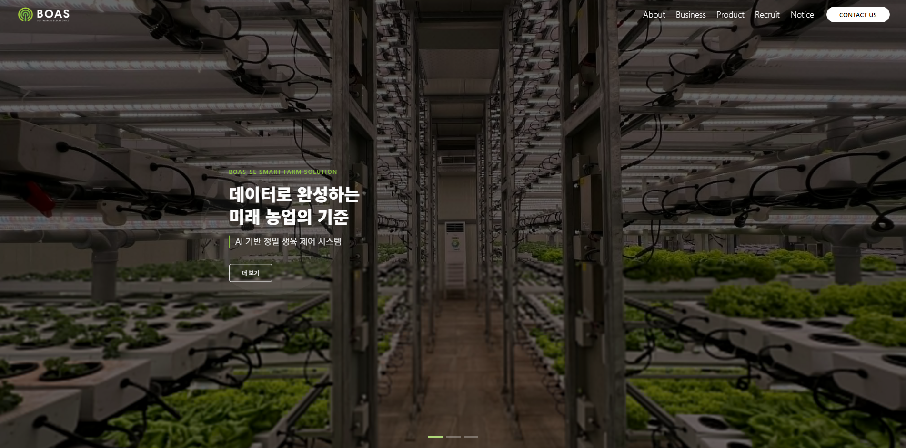
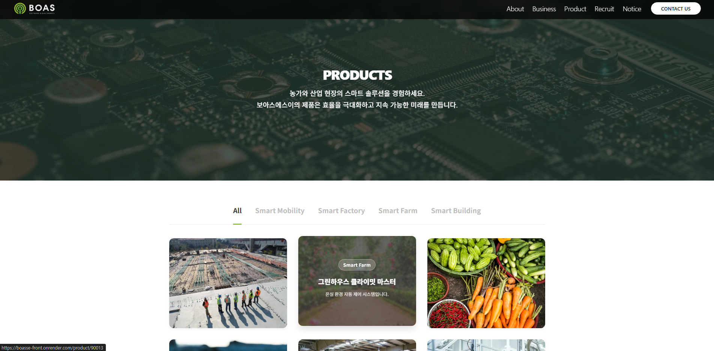
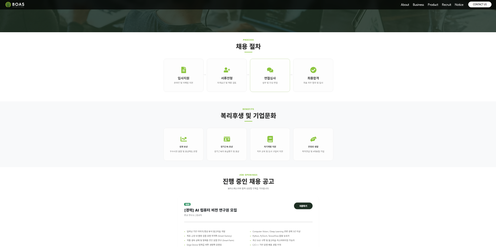
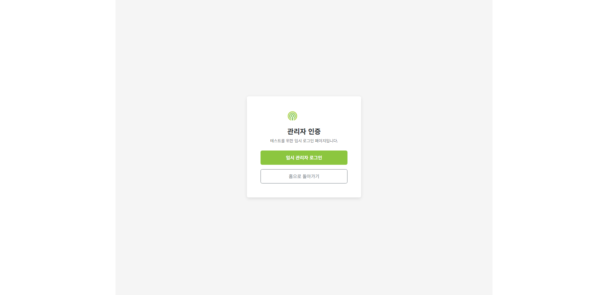
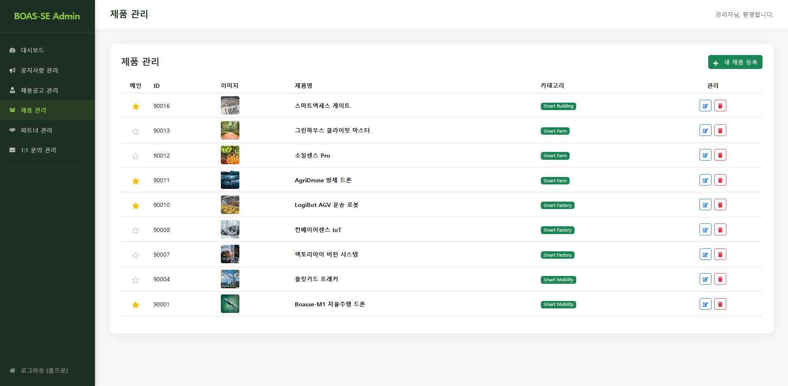

# BOAS-SE Corporate Solution

## 📝 프로젝트 소개
기업의 브랜드 정체성을 효과적으로 전달하는 공식 웹사이트와 사내 자산 및 채용 정보를 통합 관리하는 어드민 시스템입니다. 기업 방문객에게는 신뢰감 있는 정보를 제공하고, 사내 관리자에게는 데이터 제어의 편의성을 제공하는 통합 솔루션입니다.

## 💡 개발 배경 (Why?)
- 전문성 강화: 신뢰감 있는 UI와 애니메이션 인터랙션을 통해 기업의 기술적 전문성을 시각적으로 구현하고자 했습니다.
- 운영 효율화: 수동으로 관리되던 공지사항, 제품 소개, 채용 정보를 전용 관리자 도구로 일원화하여 데이터 관리의 생산성을 높였습니다.

## 👥 팀원 정보
| 사진 | GitHub | 담당 기능 |
| :---: | :--- | :--- |
|  | [kth4778](https://github.com/kth4778) | |

## 📸 화면별 이미지
- 공식 웹사이트 메인: 풀스크린 히어로 슬라이더 및 주요 비즈니스 영역 소개
- 
- 제품 소개: 카테고리별 제품 필터링 및 상세 정보 제공
- 
- 채용/공지사항: 게시판 형태의 목록 조회 및 상세 내용 확인
- 
- 관리자 로그인: 시스템 보호를 위한 보안 인증 페이지
- 
- 통합 대시보드: 게시물 현황 파악 및 전체 데이터 관리 전용 폼
